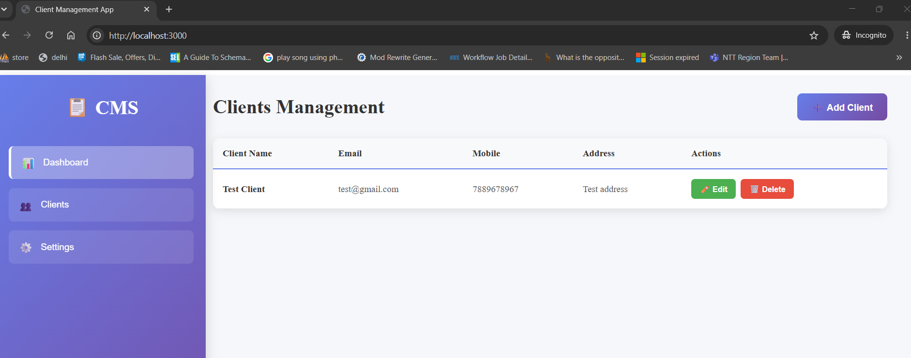
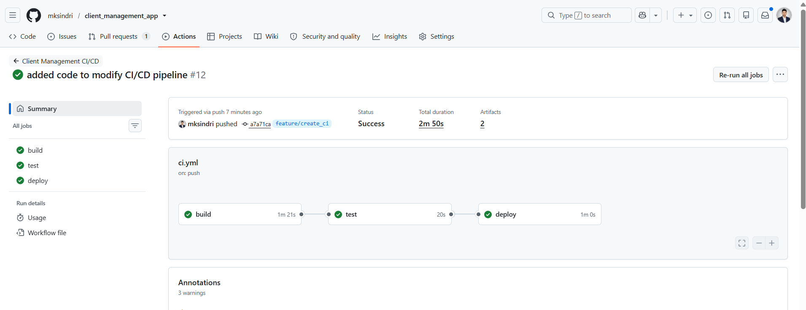

# Client Management System (CMS)

An elegant, modern, and containerized Client Management System built with a **React** frontend and a **FastAPI (Python)** backend. The application features a clean, responsive Dashboard, a Client Directory with full CRUD operations, input validation, and a pre-configured 3-stage CI/CD pipeline for automated testing and Docker Hub deployment.

---

## Table of Contents
1. [Project Overview](#project-overview)
2. [Project Structure](#project-structure)
3. [Running Locally](#running-locally)
   - [Running the Backend](#running-the-backend)
   - [Running the Frontend](#running-the-frontend)
4. [Running with Docker Compose](#running-with-docker-compose)
5. [CI/CD Pipeline Workflow](#cicd-pipeline-workflow)

---

## Project Overview

The CMS is designed to manage client directory information (Name, Email, Mobile, and Address) securely and efficiently.

* **Frontend**: Responsive React application styled with custom CSS. Includes views for:
  - **Dashboard**: High-level statistics and quick action buttons.
  - **Clients**: Comprehensive directory view with search capability, client creation, edit modal, and client deletion.
  - **Settings**: Control panel for application setup.
* **Backend**: FastAPI REST API providing fast asynchronous endpoints. 
  - **Pydantic Validation**: Performs format validation for emails, ensures mobile numbers are strictly numeric and between 10 to 15 digits, and enforces minimum lengths for names and addresses.
  - **In-Memory Storage**: Runs lightweight data storage for fast operations and demo purposes.

---

## Project Structure

```
├── .github/
│   └── workflows/
│       └── ci.yml            # 3-stage CI/CD GitHub Actions Pipeline
├── backend/
│   ├── main.py               # FastAPI application code
│   ├── test_main.py          # Pytest unit tests for REST endpoints
│   └── requirements.txt      # Python dependencies
├── frontend/
│   ├── src/                  # React component and logic files
│   ├── public/               # Static assets
│   ├── package.json          # Node.js configurations and scripts
│   └── package-lock.json
└── deployment/
    ├── docker/
    │   ├── Dockerfile.backend
    │   ├── Dockerfile.frontend
    │   └── docker-compose.test.yml
    └── nginx/
        └── nginx.conf        # Nginx reverse proxy configuration
```

---

## Running Locally

### Running the Backend

#### Prerequisites
* Python 3.9 or higher installed.

#### Step-by-Step Setup
1. **Navigate to the backend directory**:
   ```bash
   cd backend
   ```

2. **Create and activate a virtual environment (Recommended)**:
   * **Windows**:
     ```bash
     python -m venv venv
     .\venv\Scripts\activate
     ```
   * **macOS/Linux**:
     ```bash
     python3 -m venv venv
     source venv/bin/activate
     ```

3. **Install dependencies**:
   ```bash
   pip install -r requirements.txt
   ```

4. **Start the API server**:
   ```bash
   uvicorn main:app --reload --port 8000
   ```

5. **Verify the installation**:
   * Open `http://localhost:8000/` in your browser. You should see:
     `{"message": "Client Management API is running"}`
   * Open the Swagger API docs at `http://localhost:8000/docs` to test endpoints interactively.

---

### Running the Frontend

#### Prerequisites
* Node.js (v18+) and npm installed.

#### Step-by-Step Setup
1. **Navigate to the frontend directory**:
   ```bash
   cd frontend
   ```

2. **Install dependencies**:
   ```bash
   npm install
   ```

3. **Start the React development server**:
   ```bash
   npm start
   ```

4. **Open the application**:
   * Open your browser and navigate to `http://localhost:3000`. The CMS Dashboard should render, displaying the sidebar and client tables.



## Running with Docker Compose

You can boot up the entire stack (Frontend, Backend, and Nginx reverse proxy) locally inside Docker using the preconfigured Compose file:

1. Make sure Docker Desktop is running on your machine.
2. Run the following command from the root of the project:
   ```bash
   docker compose -f deployment/docker/docker-compose.test.yml up --build
   ```
3. Access the application on `http://localhost:80` (where Nginx serves the React app and proxies `/api` calls directly to the FastAPI container).

---

## CI/CD Pipeline Workflow

The GitHub Actions configuration in `.github/workflows/ci.yml` is structured into three sequential phases to ensure maximum stability and zero-downtime deployment:



### 1. Build
* Builds the backend and frontend Docker images using `docker/build-push-action`.
* Instead of pushing immediately, it exports the built images as local tar files (`outputs: type=docker,dest=/tmp/...`) and uploads them as workflow artifacts. This verifies compilation without pushing unverified builds.

### 2. Test
* Downloads the build artifacts and loads them into the runner's Docker daemon via `docker load`.
* Starts the backend and frontend containers locally using `docker run` on ports `8000` and `80`.
* Executes a health check verification script using `curl --fail` to ensure the web server and api endpoints start up and respond successfully.

### 3. Deploy
* Downloads and loads the verified build artifacts.
* Performs login to **Docker Hub** using repository secrets (`DOCKER_USERNAME` and `DOCKER_PASSWORD`).
* Tags the exact verified images with the short Git commit SHA, branch name, and `latest` (if triggered on the `main` branch), and pushes them to your Docker Hub repository.
